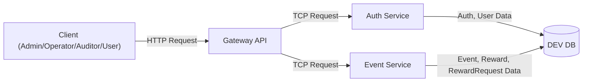
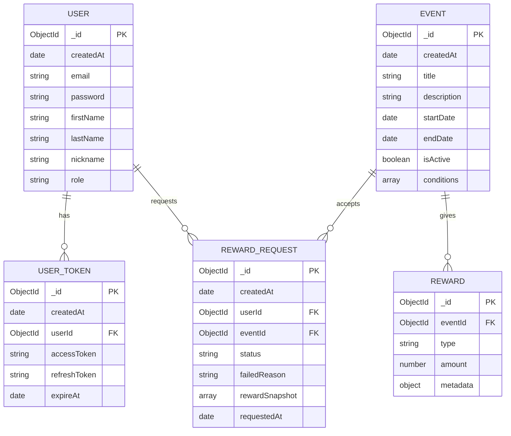

# 🎁 넥슨 이벤트, 보상 관리 플랫폼

넥슨 유저들이 유저 대상 이벤트의 조건을 충족할 때 요청된 보상을 지급하고, 유저별 보상 내역을 관리하고자 합니다.
운영자와 관리자는 이벤트와 보상을 관리하며 감사 담당자는 모든 유저의 보상 지급 내역만을 확인할 수 있습니다.

## 🔍 구현 기능

- 유저 인증 및 역할에 따른 권한(Role) 관리
- 이벤트 관리(등록 및 조회)
- 이벤트 보상 관리(등록 및 조회)
- 이벤트에 대한 유저의 보상 요청
- 전체/개인에 대한 보상 요청 내역 관리

## ✅ 요구사항 체크리스트

### 🚪 Gateway Server

- [x] 모든 요청에 대한 마이크로서비스 라우팅 처리
- [x] JWT 인증 처리 (`JwtAuthGuard`)
- [x] 역할 기반 권한 검사 (`RolesGuard`)
- [x] Auth 및 Event 서비스와 TCP 통신

### 🔐 Auth Server

- [x] 유저 등록 및 로그인
- [x] 현재 유저 정보 조회
- [x] JWT 토큰 발급 및 검증
- [x] 역할(Role) 관리 (`USER`, `OPERATOR`, `AUDITOR`, `ADMIN`)

### 🎉 Event Server

- [x] **이벤트 등록 / 조회**
    - [x] 이벤트 생성 (조건, 기간, 활성 상태, 보상(`optional`) 포함)
    - [x] 이벤트 목록 및 상세 조회
- [x] **보상 등록 / 조회**
    - [x] 보상 생성 (포인트, 아이템, 쿠폰 등)
    - [x] 보상 상세 정보 조회
- [x] **유저 보상 요청**
    - [x] 이벤트 조건 검증 - 유저별 이벤트 진행 상황은 모킹을 통해 처리
    - [x] 중복 요청 방지
    - [x] 요청 상태 및 실패시 사유 기록 (성공/대기/실패)
- [x] **보상 요청 내역 확인**
    - [x] 유저: 본인 요청만 조회 가능
    - [x] 관리자/감사자/운영자: 전체 보상 요청 내역 조회
    - [x] 필터 기능 (이벤트별, 요청 상태별, 요청 날짜별)

## 📦 사용 기술 스택

- Node.js v18
- NPM v9
- NestJS v10
    - NestJS 최신버전(v11)의
      경우, [최소 지원 버전이 Node.js v20로 제한되어](https://docs.nestjs.com/migration-guide#nodejs-v16-and-v18-no-longer-supported)
      Node.js v18 기준 최신버전인 v10을 사용했습니다.
- TypeScript v5
- MongoDB (ReplicaSet 구성)
- Docker & Docker Compose

## 💻 실행 방법

`docker compose up -d --build` 명령어로 MongoDB와 Gateway, Auth, Event 서버를 실행합니다.

```bash
$ docker compose up -d --build
```

모든 컨테이너가 준비되었다면, `MongoDB Primary` 컨테이너에 아래의 명령어를 통해 MongoDB ReplicaSet을 구성합니다.

```bash
$ docker exec -it mongodb-primary mongosh -u root -p password --eval "
  rs.initiate({
    _id: 'rs0',
    members: [
      { _id: 0, host: 'mongodb-primary:27017', priority: 2 },
      { _id: 1, host: 'mongodb-secondary:27017', priority: 1 },
      { _id: 2, host: 'mongodb-arbiter:27017', arbiterOnly: true }
    ]
  })
"
```

`Gateway` 컨테이너가 실행중인 8000번 포트의 [`/api` 엔드포인트](http://localhost:8000/api)를 통해 Swagger API 문서에 접근할 수 있습니다.

## ⚙️ 테스트 실행 방법

로컬 개발 환경에서 테스트를 실행하는 방법입니다.

```bash
$ npm run test:cov
```

`test:cov` 명령어로 전체 테스트 커버리지를 확인할 수 있습니다.

## 🕋 아키텍쳐 및 프로젝트 구조



- 아키텍쳐의 구성요소는 다음과 같습니다.
    - `Gateway API`: 모든 요청을 라우팅하고 인증 및 권한 검사를 수행합니다.
    - `Auth Service`: 유저 인증 및 역할 관리, JWT 토큰 발급 및 검증을 담당합니다.
    - `Event Service`: 이벤트 및 보상 관리, 유저 보상 요청 처리 및 내역 관리를 담당합니다.
    - `DB`: MongoDB ReplicaSet으로 구성된 데이터베이스입니다.


- 프로젝트 구조는 다음과 같이 모노레포로 구현하였습니다.
  ```text
  .
  ├── README.md
  ├── apps
  │   ├── auth
  │   ├── event
  │   └── gateway
  ├── docker-compose.yml
  ├── libs
  │   └── common
  ├── mongo
  │   ├── init.js
  │   └── mongo-keyfile
  ├── nest-cli.json
  ├── package-lock.json
  ├── package.json
  ├── tsconfig.build.json
  └── tsconfig.json
  ```
- 각 서비스들은 `apps` 디렉토리 아래에 위치하며, `libs` 디렉토리에는 공통 모듈 및 유틸리티가 포함되어 있습니다.
- `mongo` 디렉토리에는 초기화 스크립트와 MongoDB ReplicaSet을 구성하기 위한 키파일이 포함되어 있습니다.

- 각 서비스의 내부는 도메인 단위로 구분되어 있으며,
  각 도메인별로 `controller`, `service`, `repository`로 나누어져 있습니다.
  ```text
  .
  ├── auth
  │   ├── auth.controller.spec.ts
  │   ├── auth.controller.ts
  │   ├── auth.module.ts
  │   ├── auth.service.ts
  │   ├── dto
  │   ├── schema
  │   └── user-token.repository.ts
  ├── auth-service.module.ts
  ├── main.ts
  └── users
    ├── dto
    ├── schema
    ├── user.controller.ts
    ├── user.module.ts
    ├── user.repository.ts
    └── user.service.ts
  ``` 
  `gateway`의 경우, 인증/인가를 위한 guards, http 요청 기록을 위한 middlewares, 각 서비스로의 라우팅을 위한 controllers를 목적에 따라 디렉토리를
  구분해 두었습니다.
  ```text
  .
  ├── controllers
  │   ├── auth
  │   ├── events
  │   ├── reward-request
  │   ├── rewards
  │   └── users
  ├── decorators
  │   ├── current-user.decorator.ts
  │   ├── enum-type.decorator.ts
  │   └── public.decorator.ts
  ├── gateway.module.ts
  ├── guards
  │   ├── jwt-auth.guard.ts
  │   ├── jwt.strategy.ts
  │   ├── role-strategy.interface.ts
  │   ├── role.strategy.ts
  │   ├── roles.decorator.ts
  │   └── roles.guard.ts
  ├── main.ts
  └── middleware
      └── http-logger.middleware.ts
  ```

## 🏛️ 데이터 모델링 Diagram

다음은 각 서비스의 데이터 모델링을 나타낸 ERD입니다.



## 🧪 Test 결과

Jest 및 Supertest를 사용하여 각 서비스의 통합 테스트를 수행하였습니다.


## 📝 API 명세

EndPoint는 인증을 담당하는 `/auth`, 이벤트의 조회 및 생성, 보상 및 보상 요청 히스토리를 생성하는 `/events`,
보상 요청 내역의 조회 및 상태를 수정하는 `/reward-requests`, 보상 상세 조회하는 `/rewards`,
유저 정보를 조회, 생성, 수정하는 `/users`로 총 5개입니다.

API 명세는 Swagger를 통해 문서화를 진행하였습니다.

http://localhost:8000/api 로 접속하여 확인할 수 있습니다.
